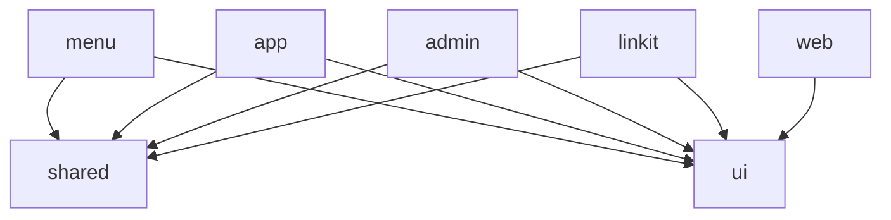

# Architecture Overview

Menud is structured as a **monorepo** managed by Turborepo, with multiple Next.js apps sharing common packages.

---

## Monorepo Structure

```
menud-frontend/
├── apps/                    # Next.js applications
│   ├── menu/                # Customer-facing digital menu (public)
│   ├── app/                 # Restaurant dashboard (authenticated)
│   ├── admin/               # Administration panel
│   ├── linkit/              # Link-in-bio pages
│   └── web/                 # Marketing website
├── packages/                # Shared packages
│   ├── shared/              # Models, adapters, API config
│   ├── ui/                  # UI components (shadcn/ui)
│   ├── eslint-config/       # Shared ESLint configuration
│   └── typescript-config/   # Shared TypeScript configuration
├── docs/                    # Documentation (bilingual)
├── scripts/                 # Utility scripts
└── turbo.json               # Turborepo configuration
```

---

## Why Turborepo?

- **Build Caching**: Turborepo caches build results, making subsequent rebuilds nearly instant
- **Parallel Execution**: Apps build in parallel when they don't depend on each other
- **Clear Dependencies**: `pnpm-workspace.yaml` explicitly defines which directories are packages
- **Environment Variables**: Shared across apps via `turbo.json`

---

## Build Flow

```
pnpm build
    │
    ▼
Turborepo analyzes dependencies
    │
    ├──► packages/shared (build first)
    ├──► packages/ui (build first)
    │
    ▼
Apps (build in parallel)
    │
    ├──► apps/menu
    ├──► apps/app
    ├──► apps/admin
    ├──► apps/linkit
    └──► apps/web
```

---

## Package Dependencies



---

## Turborepo Pipeline

Defined in `turbo.json`:

| Task | Dependencies | Cache | Description |
|------|-------------|-------|-------------|
| `build` | `^build` | Yes | Compiles the app and its dependencies |
| `dev` | None | No | Development mode (watch mode) |
| `lint` | `^lint` | Yes | Checks code style |
| `lint:fix` | `^lint:fix` | Yes | Fixes style issues |
| `check-types` | `^check-types` | Yes | TypeScript type checking |

---

## Architecture Pattern per App

Each app follows a consistent pattern:

```
apps/[name]/
├── app/                    # Next.js App Router (pages/routes)
├── modules/                # Feature modules
│   └── [feature]/
│       ├── components/     # React components
│       ├── services/       # Business logic / API calls
│       ├── providers/      # Context providers
│       ├── hooks/          # Custom hooks
│       └── models/         # TypeScript types
├── public/                 # Static assets
├── next.config.ts          # Next.js configuration
├── tailwind.config.ts      # Tailwind configuration
├── tsconfig.json           # TypeScript configuration
└── Dockerfile              # For containerized deployment
```

---

## Monitoring and Deployment

```
Code → GitHub → GitHub Actions → Docker Build → GHCR → Portainer → Server
```

See [Deployment Guide](../guides/deployment.md) for complete details.

---

**See also:** [Menu App](apps/menu.md) | [App Dashboard](apps/app.md) | [Shared Package](packages/shared.md)
