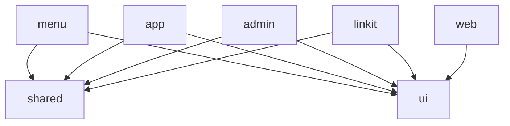

# Visión General de la Arquitectura

Menud está estructurado como un **monorepo** gestionado por Turborepo, con múltiples apps Next.js que comparten paquetes comunes.

---

## Estructura del Monorepo

```
menud-frontend/
├── apps/                    # Aplicaciones Next.js
│   ├── menu/                # Menú digital para clientes (pública)
│   ├── app/                 # Dashboard del restaurante (auth)
│   ├── admin/               # Panel de administración
│   ├── linkit/              # Link-in-bio para negocios
│   └── web/                 # Sitio web de marketing
├── packages/                # Paquetes compartidos
│   ├── shared/              # Modelos, adaptadores, config API
│   ├── ui/                  # Componentes UI (shadcn/ui)
│   ├── eslint-config/       # Configuración ESLint compartida
│   └── typescript-config/   # Configuración TypeScript compartida
├── docs/                    # Documentación (bilingüe)
├── scripts/                 # Scripts utilitarios
└── turbo.json               # Configuración de Turborepo
```

---

## ¿Por qué Turborepo?

- **Cache de Builds**: Turborepo cachea los resultados de build, haciendo que rebuilds subsiguientes sean casi instantáneos
- **Ejecución Paralela**: Las apps se compilan en paralelo cuando no dependen entre sí
- **Dependencias Claras**: El `pnpm-workspace.yaml` define explícitamente qué directorios son paquetes
- **Variables de Entorno**: Se comparten entre apps vía `turbo.json`

---

## Flujo de Build

```
pnpm build
    │
    ▼
Turborepo analiza dependencias
    │
    ├──► packages/shared (build primero)
    ├──► packages/ui (build primero)
    │
    ▼
Apps (build en paralelo)
    │
    ├──► apps/menu
    ├──► apps/app
    ├──► apps/admin
    ├──► apps/linkit
    └──► apps/web
```

---

## Dependencias entre Paquetes



---

## Pipeline de Turborepo

Definido en `turbo.json`:

| Tarea | Dependencias | Cache | Descripción |
|-------|-------------|-------|-------------|
| `build` | `^build` | Sí | Compila la app y sus dependencias |
| `dev` | Ninguna | No | Modo desarrollo (watch mode) |
| `lint` | `^lint` | Sí | Verifica estilo de código |
| `lint:fix` | `^lint:fix` | Sí | Corrige problemas de estilo |
| `check-types` | `^check-types` | Sí | Verificación de tipos TypeScript |

---

## Patron de Arquitectura por App

Cada app sigue un patrón consistente:

```
apps/[nombre]/
├── app/                    # Next.js App Router (pages/rutas)
├── modules/                # Módulos de features
│   └── [feature]/
│       ├── components/     # Componentes React
│       ├── services/       # Lógica de negocio / API calls
│       ├── providers/      # Context providers
│       ├── hooks/          # Custom hooks
│       └── models/         # Tipos TypeScript
├── public/                 # Assets estáticos
├── next.config.ts          # Configuración de Next.js
├── tailwind.config.ts      # Configuración de Tailwind
├── tsconfig.json           # Configuración TypeScript
└── Dockerfile              # Para despliegue containerizado
```

---

## Monitoreo y Deployment

```
Código → GitHub → GitHub Actions → Docker Build → GHCR → Portainer → Servidor
```

Ver [Guía de Despliegue](../guides/deployment.md) para detalles completos.

---

**Ver también:** [Menu App](apps/menu.md) | [App Dashboard](apps/app.md) | [Paquete Shared](packages/shared.md)
